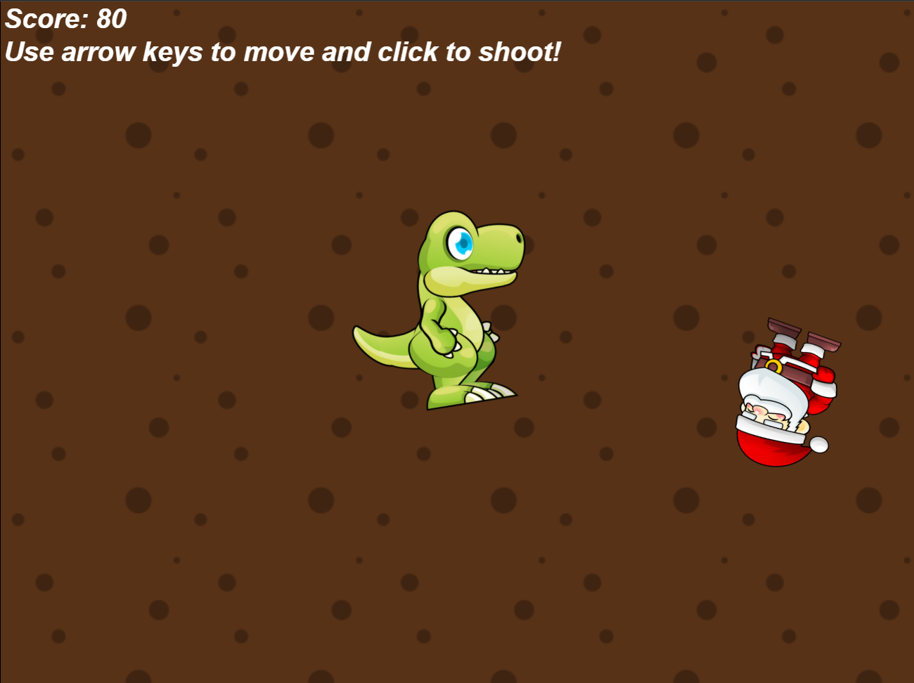
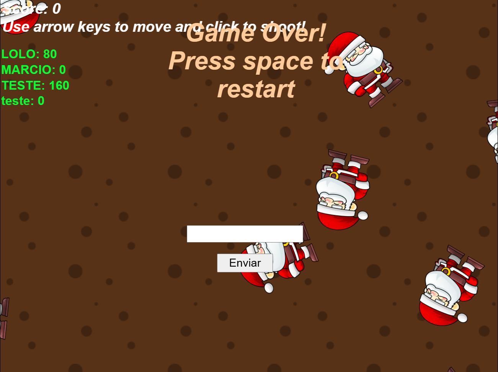
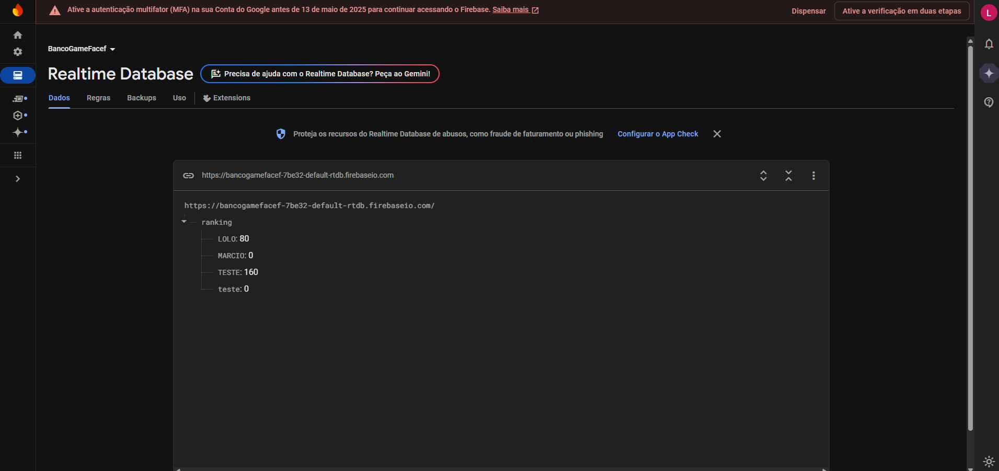

# Sobre o Jogo

Este jogo foi desenvolvido com o objetivo de aprimorar habilidades em criação de games 2D.  
O jogador controla um dinossauro que dispara bolas de fogo contra hordas de papais-noéis malvados.  
O objetivo é sobreviver o maior tempo possível e acumular pontos eliminando os inimigos.

# Funcionalidades

- Controle de um dinossauro com ataques de fogo.
- Inimigos variados com comportamentos diferentes.
- Sistema de pontuação baseado nos inimigos derrotados.
- Aumento gradual da dificuldade conforme o tempo de jogo.

# Tecnologias Utilizadas

- **Plataforma de Desenvolvimento:** Construct 3  
- **Motor Gráfico:** Construct 3  
- **Banco de Dados:** Firebase (NoSQL)

